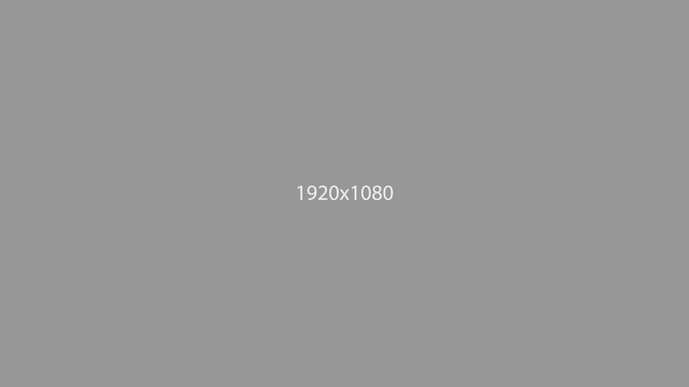
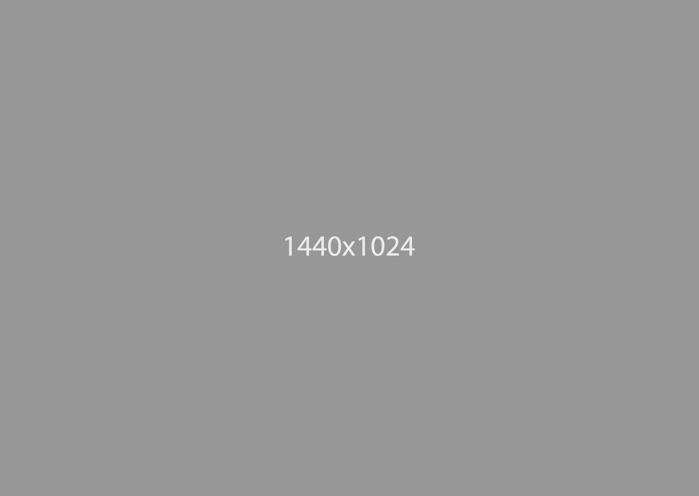

# Мои проект

Здесь вы можете ознакомиться с реализованными мною проектами

## Веб-приложение - сайт-блог веб-студии (**[ссылка на репозиторий](https://github.com/batnd/spa-web-blog)**).
### Краткое описание
Самостоятельно выполненный проект выполнен в рамках обучения на курсе "Профессия Frontend-Разработчик" в онлайн-школе "Айтилогия".
### Внешний вид

## Веб-приложение - сайт-блог веб-студии (**[ссылка на репозиторий](https://github.com/batnd/spa-web-blog)**).
### Краткое описание
Самостоятельно выполненный проект выполнен в рамках обучения на курсе "Профессия Frontend-Разработчик" в онлайн-школе "Айтилогия".
### Внешний вид

## Веб-приложение - сайт-блог веб-студии (**[ссылка на репозиторий](https://github.com/batnd/spa-web-blog)**).
### Краткое описание
Самостоятельно выполненный проект выполнен в рамках обучения на курсе "Профессия Frontend-Разработчик" в онлайн-школе "Айтилогия".
### Внешний вид

## Веб-приложение - сайт-блог веб-студии (**[ссылка на репозиторий](https://github.com/batnd/spa-web-blog)**).
### Краткое описание
Самостоятельно выполненный проект выполнен в рамках обучения на курсе "Профессия Frontend-Разработчик" в онлайн-школе "Айтилогия".
### Внешний вид

