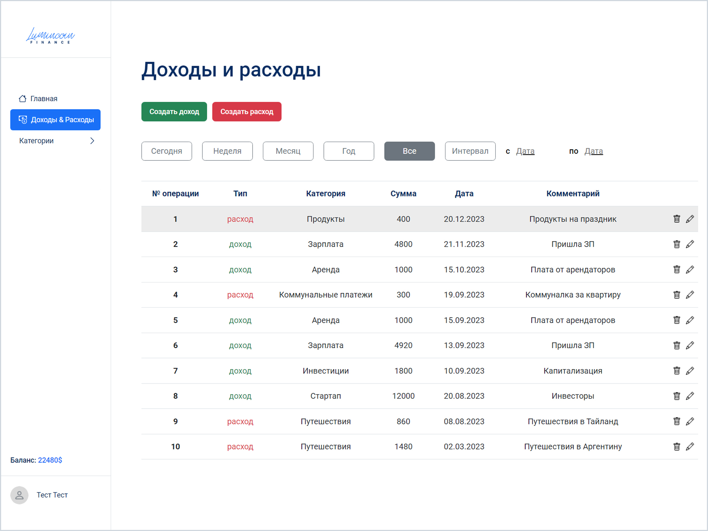
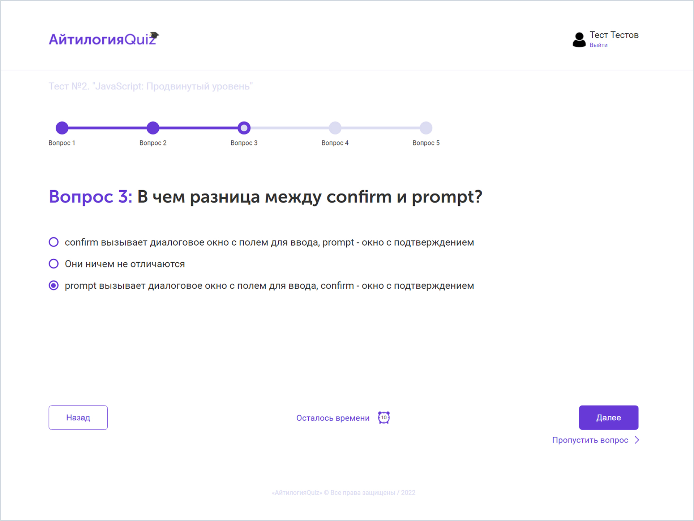
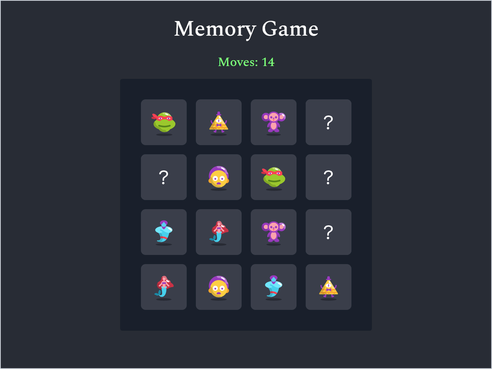
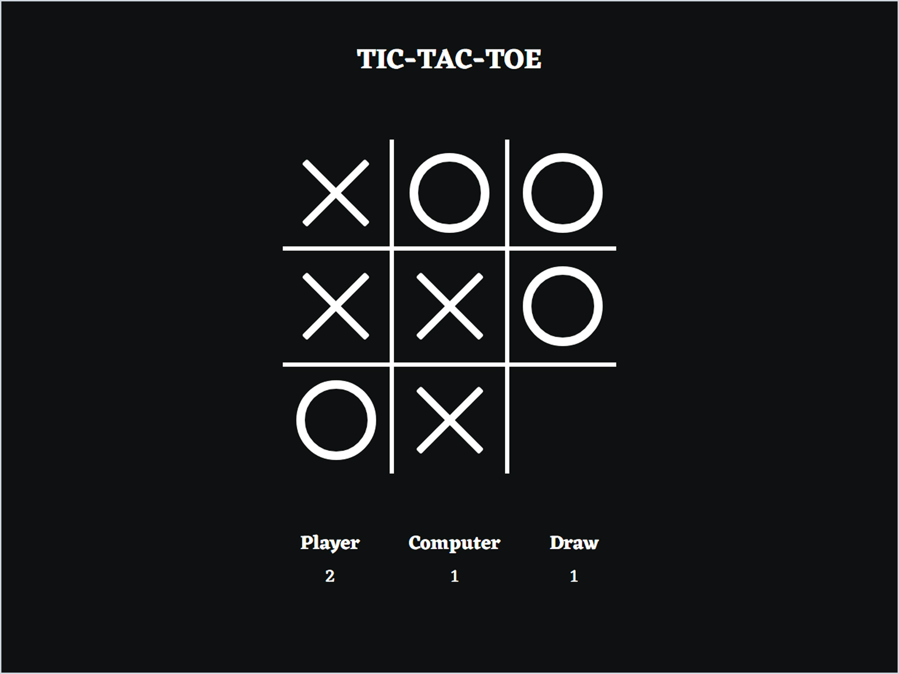
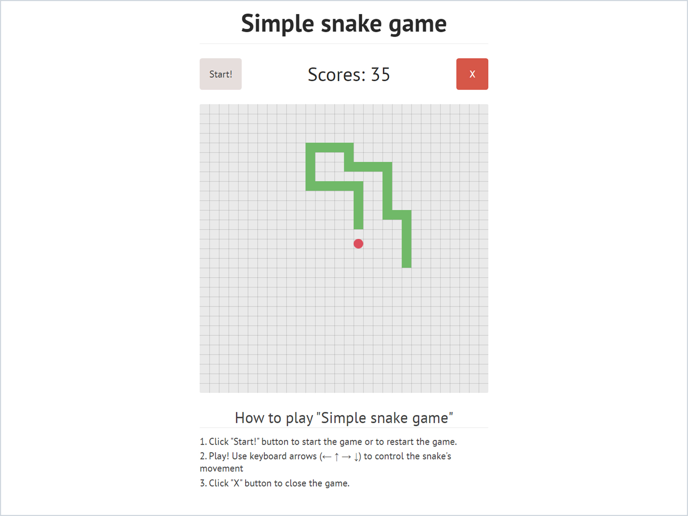

# Мои проекты
#### Здесь вы можете ознакомиться с моими проектами.

## 1. Веб-приложение - сайт-блог на Angular (учебный проект).
### Репозиторий проекта: **[сайт-блог на Angular](https://github.com/batnd/spa-web-blog)**

### Описание
Сайт-блог веб-студии, выполненный на **фреймворке Angular**.  
С возможностями, выполненными задачами и **технологиями** можно ознакомиться в репозитории проекта. 

### Внешний вид

## 2. Веб-приложение - интернет-магазин на Angular (учебный проект).
### Репозиторий проекта: **[интернет-магазин на Angular](https://github.com/batnd/spa-decor-shop)**

### Описание
Интернет-магазина домашнего декора, выполненный на **фреймворке Angular**.  
С выполненными задачами, возможностями и используемыми **технологиями** можно ознакомиться в репозитории проекта

### Внешний вид

## 3. Веб-приложение - учёт финансов (учебный проект).
### Репозитории проектов: **[Проект на TypeScript](https://github.com/batnd/spa-financial-accounting-typescript)** | **[Проект на JavaScript](https://github.com/batnd/spa-financial-accounting-javascript)**

### Описание
Приложение для учета финансов, выполненное на **TypeScript** и **JavaScript**.  
С возможностями, выполненными задачами и **технологиями** можно ознакомиться в репозиториях проектов.

### Внешний вид

## 4. Веб-приложение - quiz-викторина (учебный проект).
### Репозитории проектов: **[Проект на Angular](https://github.com/batnd/spa-quiz-angular)** | **[Проект на TypeScript](https://github.com/batnd/spa-quiz-typescript)** | **[Проект на JavaScript](https://github.com/batnd/spa-quiz-javascript)**

### Описание
Веб-приложение quiz-викторина, выполненная на **Angular**, **TypeScript** и **JavaScript**.  
С возможностями, выполненными задачами и **технологиями** можно ознакомиться в репозиториях проектов.

### Внешний вид

## 5. Игра - "Найди пару" - Memory Game (учебный проект).
### Репозитории проектов: **[Проект на Angular](https://github.com/batnd/game-angular-memoryGame)** | **[Проект на React](https://github.com/batnd/game-react-memoryGame)**

### Описание
Простая игра "Найди пару" (Memory game), выполненная на **Angular** и **React**.  
С возможностями, выполненными задачами и **технологиями** можно ознакомиться в репозиториях проектов.

### Внешний вид

## 6. Игра - "Крестики-нолики" - Tic-Tac-Toe (учебный проект).
### Репозитории проектов: **[Проект на Angular](https://github.com/batnd/game-angular-ticTacToe)** | **[Проект на Vue.js](https://github.com/batnd/game-vue-ticTacToe)**

### Описание
Простая игра "Крестики-нолики" (Tic-Tac-Toe), выполненная на **Angular** и **Vue.js**.  
С возможностями, выполненными задачами и **технологиями** можно ознакомиться в репозиториях проектов.

### Внешний вид

## 7. Игра - "Змейка" - Snake (учебный проект).
### Репозиторий проекта: **[игра "Змейка"](https://github.com/batnd/game-javascript-snake)**

### Описание
Простая игра "Змейка" (Snake), выполненная на **JavaScript**.  
С возможностями, выполненными задачами и **технологиями** можно ознакомиться в репозиториях проектов.

### Внешний вид
