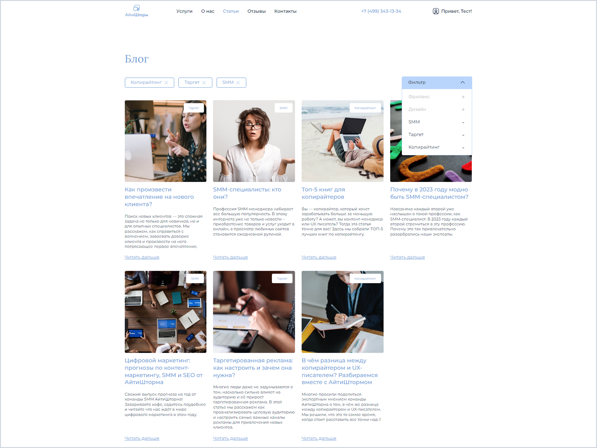
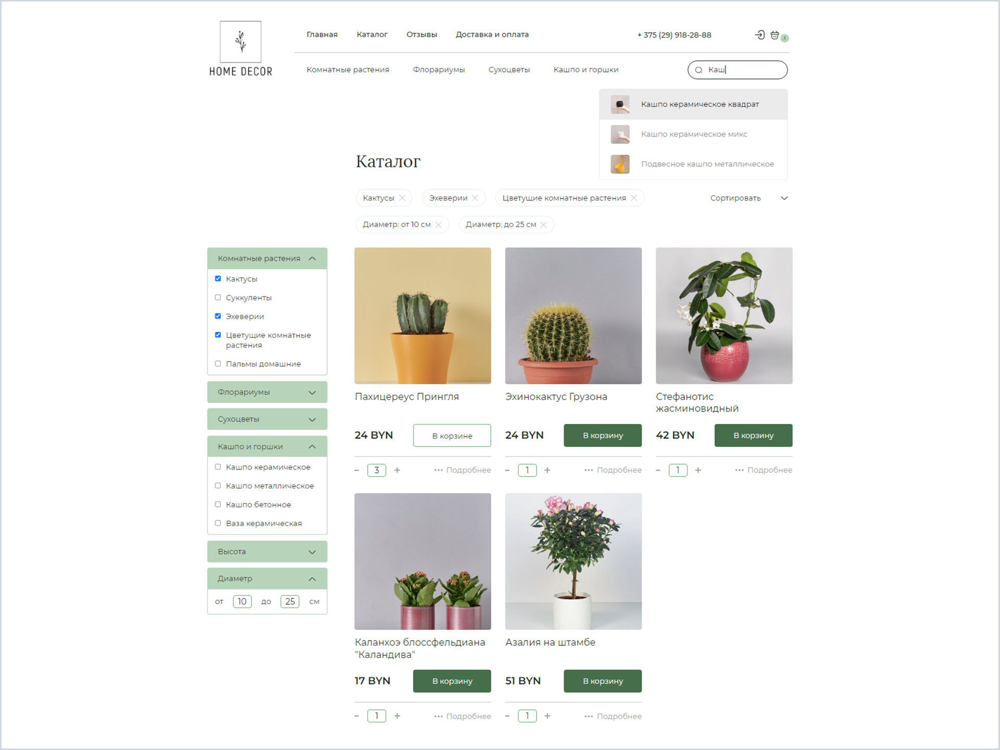

# Мои проекты
#### Здесь вы можете ознакомиться с моими проектами.

## 1. **[Веб-приложение](https://github.com/batnd/spa-web-blog)** - сайт-блог веб-студии (учебный проект).

### Описание
Реализация сайта-блога веб-студии на фреймворке Angular.  
С выполненными задачами, возможностями и используемыми **технологиями** можно ознакомиться в **[репозитории проекта.](https://github.com/batnd/spa-web-blog)**

### Внешний вид

## 2. **[Веб-приложение](https://github.com/batnd/spa-web-blog)** - интернет-магазин домашнего декора (учебный проект).

### Описание
Реализация интернет-магазина домашнего декора на фреймворке Angular.  
С выполненными задачами, возможностями и используемыми **технологиями** можно ознакомиться в **[репозитории проекта.](https://github.com/batnd/spa-decor-shop)**

### Внешний вид
